# Instant

A Django **single-app template**: clone it, build your app in `ourapp/`, and drive
changes through an agent that edits a throwaway.

## Features
- **Agent-driven development** — a [pi](https://pi.dev)
  TUI
  edits a throwaway `scratch/` copy of the repo; you review, then
  `deployscratch` checks + deploys to `main/` (server auto-reloads). Start it with
  `./run pi` — on the VM from a multipass shell as the `agent` user
  (`sudo -iu agent`, same command there). See
  [Edit → test → deploy workflow](#edit--test--deploy-workflow).
- **Async tasks + cron (Huey)** — Redis-backed background tasks and scheduled
  jobs via `huey.contrib.djhuey` (reusing the same Redis as the error rate
  limiter). Run the consumer with `./run hueydev` (or `./run dev`). The reference
  app ships a daily "Fact of the Day" cron as the example (`docs/reference/`).
- **Models management** — a superuser UI at `/manage/models` to browse, sort,
  inspect and edit any model's rows, with a per-row audit log
  (create/update/delete diffs). See [Models management (superuser)](#models-management-superuser).
- **User management** — `/users` CRUD + search, identity by `public_id` (never
  the integer `pk`), audit history, and Google social login. See
  [User management](#user-management) and [Google OAuth](#google-oauth-social-login).
- **File browser** — `/files` to browse and preview the repo filesystem in-app.
  See [Code viewer (superuser)](#code-viewer-superuser).
- **Git viewer** — `/git` to browse commits, view diffs, and inspect the
  uncommitted working tree. See [Code viewer (superuser)](#code-viewer-superuser).
- **Notifications** — `/notifications`: every user's bell, list, and browser
  (Web Push) delivery — rows live until deleted; pushes ride the user's live
  sessions (logout/GC cascade-drops them) via VAPID (see `generatevapid`). See
  [Notifications](#notifications).
- **Structured logging** — one NDJSON line per record across the backend **and**
  frontend-reported errors (`/client-errors`, rate-limited via Redis), all
  `jq`-filterable. See [Logging](#logging).
- **Single-page Inertia + Vue frontend** — one build, sourcemaps emitted for
  offline row:col resolution; framework pages under `frontend/src/pages/`, the
  app's own under `frontend/src/ours/`.
- **Design mockups** — throwaway superuser-only `/mockup-<feature>` pages with
  a crosshatch overlay let you review a UI before it's built
  (the convention lives in `agentconfig/steer.md`; `/mockup-todos` ships as the
  permanent demo — see [Edit → test → deploy workflow](#edit--test--deploy-workflow)).

## Quick start
- **Prerequisites** — Python 3.14+ with [`uv`](https://docs.astral.sh/uv/),
  Node.js + npm, PostgreSQL, and Redis run the app;
  [pi](https://pi.dev) runs the agent
  (`npm install -g --ignore-scripts @earendil-works/pi-coding-agent`).
- **Environment** — `./run init` copies `.env.example` → `.env`, generates
  `SECRET_KEY`, creates + migrates the database, and builds the frontend;
  set `DB_PASSWORD` to your local postgres afterwards.
- **Run** — `./run dev` starts runserver + vite + huey in
  one terminal (Ctrl-C stops all); then open
  http://127.0.0.1:8000/ — `ourapp/` is a placeholder landing page, and
  `docs/reference/` holds the copyable example app (facts + todos).
- **First user** — there is no signup flow: create the row and sign in via a
  one-time link —
  `./run djangomanage createuser you@example.com --first-name You --last-name Name --superuser`
  then `./run djangomanage makeloginlink you@example.com` (opens
  `/login-for-test/<key>/`, single use; `promotetosuperuser <email>`
  promotes an existing user later).
- **Google login** (dev) — register OAuth credentials and store them with
  `./run djangomanage addoauth google <client_id> <secret>`.
- **Agent** — point your AI agent at this repo and have it read
  `INSTRUCTIONS.md` (the operating manual: workflows, conventions,
  command allowlist); start it with `./run pi`.
- **Test VM instead** — the whole loop can run on a Linux VM (multipass):
  see [VM (test server)](#vm-test-server).

## VM (test server)

The whole loop can run on a Linux VM (multipass) instead of your local
machine; the workstation becomes just a browser + ssh client. All VM config
lives in one env file — copy the template first:

```bash
cp .env.vm.example .env.vm    # then fill in generated secrets
```

- **Secrets**: `SECRET_KEY` and `DB_PASSWORD` ship as `DANGEROUSLYUNSET`
  and provisioning refuses to build on that value (validated host-side by
  `./testvm provision`, before anything ships). Generate high-entropy
  values with `openssl rand -hex 32`.
- Database names are fixed (`app_db`/`app_user` from the env values) — one
  app per VM by design.

Then one command builds everything (2G RAM + 2G swap, postgres + redis
localhost-only, caddy TLS, `/srv/app/main` (a `scratch/` sibling appears
when you run `./run createscratch` there), systemd units
`app_granian` + `app_huey` under the **less powerful `app` user** — huey
always enabled, `HUEY_WORKERS` ≥ 1 enforced at provisioning):

```bash
./testvm provision              # builds and prints access + login steps
```

One hostname, one port, reached through an ssh forward — the tunnel is the
only entry (the VM announces and serves no LAN name). The internal-CA cert
means a click-through warning (the supported mode):

- **`https://localhost:8000/`** — the app, once the tunnel is up:

  ```bash
  # one-time: let your host key in (provisioning installs no authorized_keys)
  multipass exec app -- bash -c \
    'mkdir -p -m 700 ~ubuntu/.ssh && cat >> ~ubuntu/.ssh/authorized_keys && chmod 600 ~ubuntu/.ssh/authorized_keys' \
    < ~/.ssh/id_ed25519.pub
  multipass info app | grep IPv4      # the VM's bridged IP

  # each session: forward host :8000 → the VM's caddy (:443); leave running
  ssh -N -L 8000:localhost:443 ubuntu@<vm-ip>
  ```

  Host port 8000 collides with the dev runserver — never both at once.
  Login is Google OAuth (localhost is Google's dev redirect exception):
  register `https://localhost:8000/accounts/google/login/callback/` in the
  Google console, then store the credentials on the VM —

  ```bash
  multipass exec app -- sudo -u app -H bash /srv/app/main/deploy/vm.sh \
    runasapp .venv/bin/python manage.py addoauth google <client_id> <secret>
  ```

  — or issue a one-time link for an existing user (single use, 15-min
  expiry), then `promotetosuperuser <email>` to unlock admin pages:

  ```bash
  multipass exec app -- sudo -u app -H bash /srv/app/main/deploy/vm.sh \
    runasapp .venv/bin/python manage.py makeloginlink <email>
  ```

**Everything else happens on the VM**: `./run createscratch` → `./run
pi` (from a multipass shell as the `agent` user) edits `scratch/` →
`./run deployscratch` (check battery + deploy + migrate; on the VM
collectstatic + service restarts fold in automatically). The env on the
VM is a single file all services share
(`/etc/credentials/app/.env.vm`, staged from the root `.env.vm`).

Provisioning is **build-or-destroy**: it refuses when the VM exists — to
apply changes, delete and rebuild.

```bash
./testvm delete                 # multipass delete+purge — destructive, no backup step
```

The VM's `.git` is its own history — copy anything you need off it
(tar via `multipass transfer`, `pg_dump` via `multipass exec`) before
deleting. Plan + full manifest of
everything provisioning touches: `prompts/20260818-vm-provisioning-multipass.md`.

## Google OAuth (social login)

Credentials live in the database, not in settings or `.env`. After the first
`migrate`, register the Google app once:

```bash
# leading space should be kept to avoid storing command in bash history
 ./run djangomanage addoauth google <client_id> <secret>
```

This creates (or updates) a `SocialApp` for `provider="google"` linked to the
current `SITE_ID`, with
`scope=["profile","email"]` and
`auth_params={"access_type":"online"}` — the equivalent of the old
`SOCIALACCOUNT_PROVIDERS` block. Re-run it to rotate credentials; no duplicate
row is created. This is for DEV (or any deployment whose hostname Google
accepts); the test VM skips Google OAuth entirely and logs in via one-time
`makeloginlink` URLs — see [VM (test server)](#vm-test-server).

Other providers: exactly two lines in `djangoproject/settings.py` are
hardcoded to Google (the `INSTALLED_APPS` provider app and the CSP
`form-action` domain) — the full recipe is in
[docs/social-providers.md](docs/social-providers.md).

## Sign in (one-time login link)

There is no signup flow and (in dev) possibly no Google login yet — sign in
by issuing a one-time link for an existing user (e.g. one created with
`createuser`):

```bash
./run python manage.py makeloginlink alice@example.com
```

Open the printed `/login-for-test/<key>/` URL once — single use,
15-minute expiry (`--minutes N` to change), and only the SHA-256 of the key
is stored. Superusers can also issue the same link from a user's details
page (`/users/id/<public_id>` → "Login link"), with 15 m / 1 h / 8 h / 24 h
TTLs and a copy button.

Session lifetime is **sliding**: a session expires `SESSION_IDLE_DAYS`
after the user's last *successful* request (set in `.env` — required, no
silent default), not after login. `SessionIdleTouchMiddleware`
re-arms the deadline (amortized at half-life; 5xx responses don't extend
it), and huey's daily `clearsessions` purges expired sessions.

## Promote a user to superuser

Social-login users can't be superuser at creation. Promote an existing user by
email (matched case-insensitively; sets both `is_superuser` and `is_staff` so
`/admin` works):

```bash
./run python manage.py promotetosuperuser alice@example.com
```

Once promoted, that user can reach the management routes below.

## The user app (`ourapp/`)

`ourapp/` is a normal Django app (in `INSTALLED_APPS`). It ships with only the
landing page — you add your features there and in its frontend. Features are
split into modules (one per feature), never stuffed into one file:

- **Models** (`ourapp/models/`): one module per feature (`models/<feature>.py`),
  imported in `models/__init__.py` so Django finds them. Each concrete class
  subclasses `djangoapp.models.BaseModel`, which provides `public_id`, audit
  fields (`created_by`, `created_at`, `last_updated_at`, `last_updated_by`) and
  `get_absolute_url()`. Give each a docstring. Add/change a model →
  `./run djangomanage makemigrations ourapp`.
- **API** (`ourapp/views/`): one django-ninja `Router` per feature
  (`views/<feature>.py`); `views/__init__.py` owns the single `NinjaAPI` and
  registers every router. Page responses render via Inertia
  (`InertiaResponse(request, "ours/<Page>", {"props": …})`), data responses are
  pydantic schemas.
- **URLs** (`ourapp/urls.py`): mounts the ninja API at the project root, so each
  route is served at its literal URL — **including the landing page `/`**, which
  the app owns (the framework serves no home route).
- **Commands** (`ourapp/management/commands/`): seed/setup commands, one module
  per command.
- **Tests**: `ourapp/tests/` — flat, one file per feature + layer
  (`test_<feature>_<layer>.py`; layer = `models`/`views`/`commands`/`playwright`).
  Playwright files are tagged so `./run test` skips them and `./run playwrighttest`
  runs them.
- **Frontend**: one Vue+Inertia app. App pages live in
  `frontend/src/ours/pages/<Name>.vue` (component name `ours/<Name>`); shared
  components in `frontend/src/ours/components/`.

The app also has its own `README.md` (a brief feature catalog) and `docs/`
(one markdown file per feature, linked from the README). See
`agentconfig/steer.md` for the "Checklist — adding or changing a feature".

See `docs/reference/` for a complete copyable example (the **facts** feature —
a `Topic` + `Fact`, a seed command, two pages — and the **todos** feature — a
`Todo` owned by a `User`, one page).

## Models management (superuser)

Mounted under `/manage` (superuser-only; anyone else gets a 404). Lists every
concrete `BaseModel` subclass in `ourapp/` by class name, with its docstring and
browseable rows. A foreign-key cell links to the referenced row via that row's
`get_absolute_url()`.

<figure>
  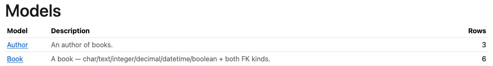
  <figcaption><code>/manage/models</code> — every model with its docstring and row count.</figcaption>
</figure>

<figure>
  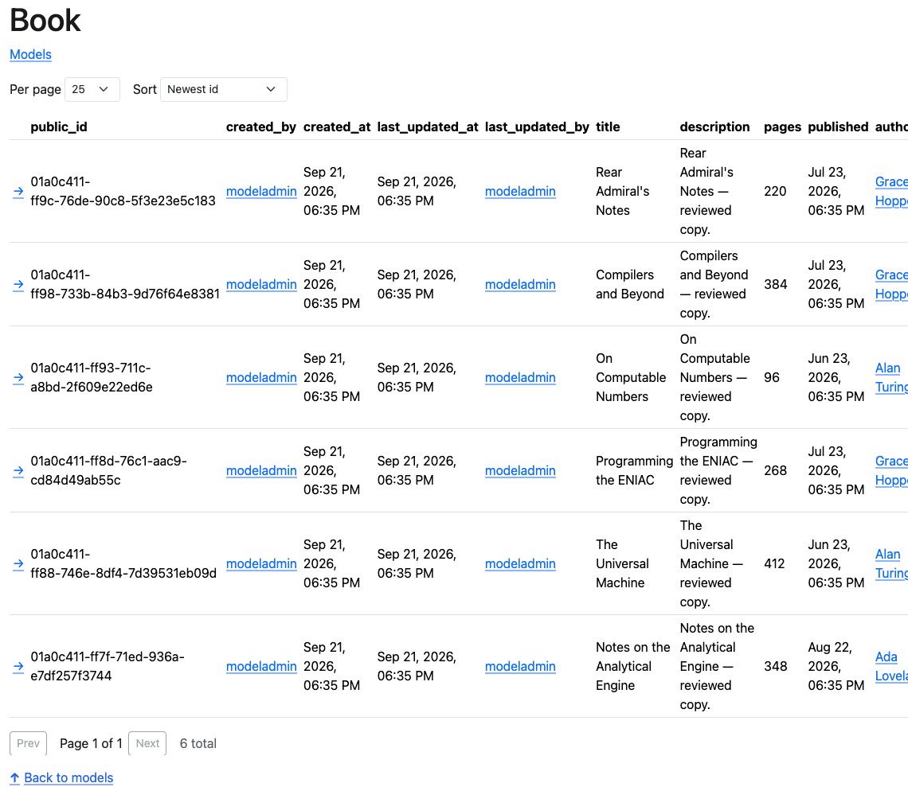
  <figcaption><code>/manage/models/&lt;model&gt;/list</code> — paginated rows, sortable by created/edited.</figcaption>
</figure>

<figure>
  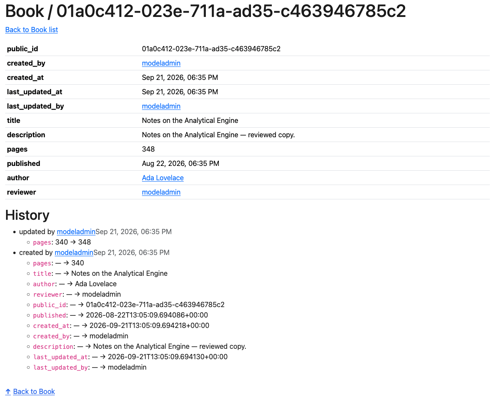
  <figcaption><code>/manage/models/&lt;model&gt;/id/&lt;public_id&gt;</code> — the row's columns and audit log.</figcaption>
</figure>

## Code viewer (superuser)

The navbar's single "Code" link — one surface for reviewing what changed
before a deploy. Both parts are superuser-only (anyone else gets a 404) and
read-only; the git side reads `main` (and `scratch/` when it exists), the
files side browses the repo's parent directory (so `main/…` paths are the
deployed truth) and previews files in-app — rendered markdown, highlighted
code, and images.

### Git viewer

<figure>
  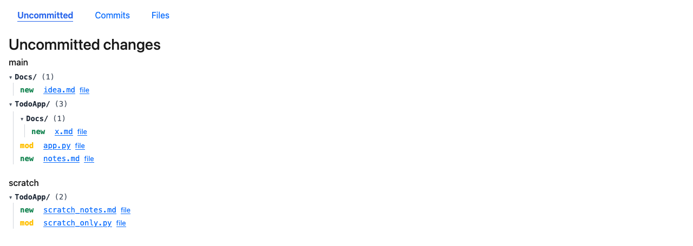
  <figcaption><code>/git/uncommitted</code> — both worktrees' uncommitted files, as folder trees.</figcaption>
</figure>

<figure>
  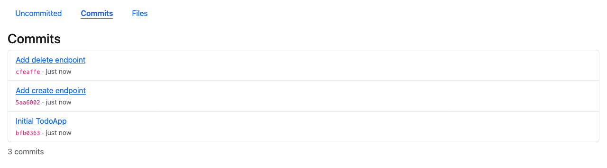
  <figcaption><code>/git/commits</code> — newest-first history; each entry links to its files.</figcaption>
</figure>

<figure>
  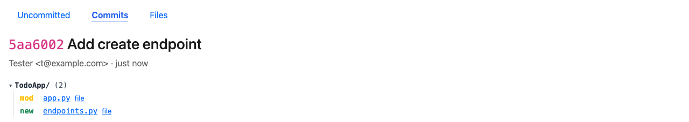
  <figcaption><code>/git/commits/&lt;sha&gt;</code> — the commit's changed files.</figcaption>
</figure>

<figure>
  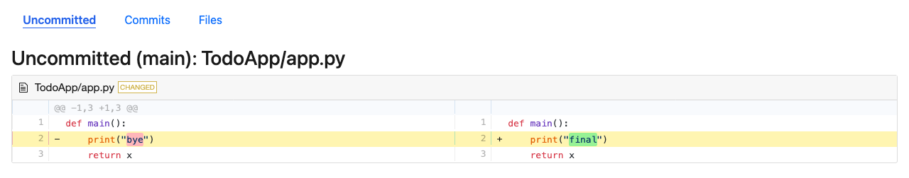
  <figcaption><code>/git/uncommitted/&lt;worktree&gt;/&lt;path&gt;</code> — one file's diff, side by side (same view at <code>/git/commits/&lt;sha&gt;/&lt;path&gt;</code> for committed files).</figcaption>
</figure>

### File browser

<figure>
  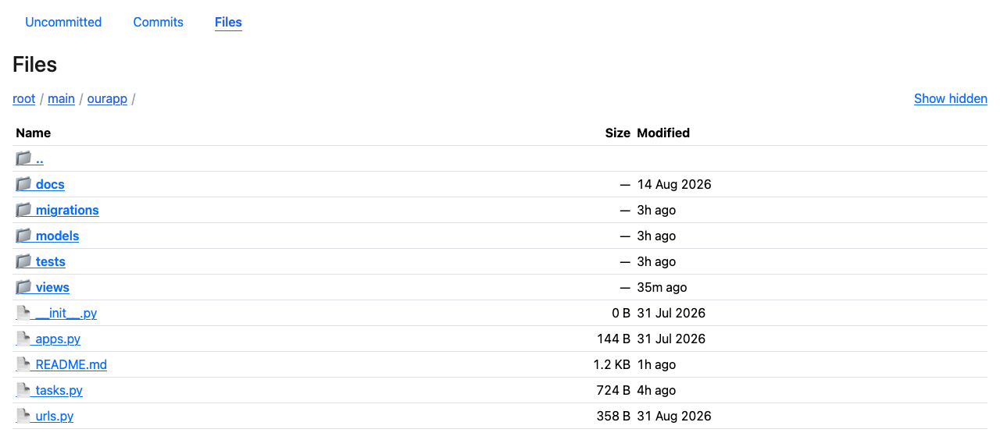
  <figcaption><code>/files/&lt;path&gt;</code> — directory listing with breadcrumb and hidden-entry toggle.</figcaption>
</figure>

<figure>
  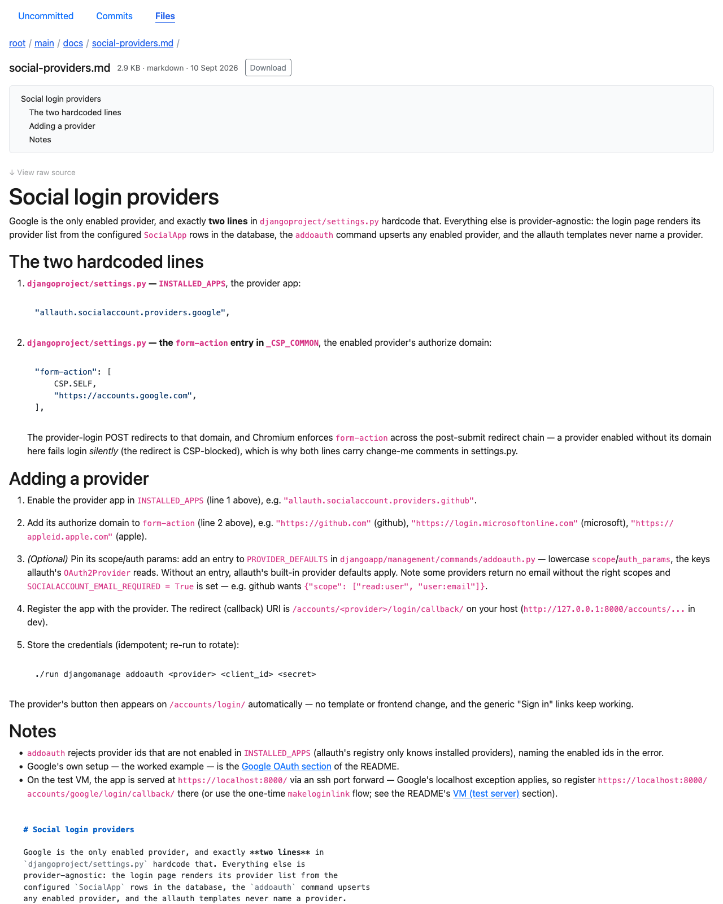
  <figcaption><code>/files/&lt;path&gt;</code> — rendered markdown with its heading outline.</figcaption>
</figure>

## Edit → test → deploy workflow

The repo is `main/` (with `.git`); `scratch/` is a throwaway sibling (the
agent reaches it via `../scratch` — pre-approved in agentconfig). For every
change:

1. `./run createscratch` (from `main/`) — copy `main/` (minus caches/build output)
   into a fresh `../scratch/`, sharing `main`'s `.git` (main's HEAD is frozen
   as the `scratch-baseline` ref), and bootstrap its env incrementally
   (`uv sync` + `npm install` over hardlink-copied `.venv`/`node_modules`).
2. Edit `../scratch/` — then review the changes against `main/` in the
   [code viewer](#code-viewer-superuser) (its uncommitted page shows both
   worktrees side by side).
3. `./run deployscratch` — **run from `main/`, never from scratch's own
   `./run` (it refuses)**. The check battery: ruff + mypy + `ourapp` tests +
   frontend lint/type-check/build (the fast loop: the framework suite and
   Playwright stay in `main/`). Must finish green. When scratch edits touch
   framework files (outside `ourapp/` + `frontend/src/ours/`), it also runs
   the tagged `scratch-test-subset` smoke tests. Run `checkframework1` in
   `main/` for the full gate.
4. the same command's tail — deploy `../scratch/` into `main/` (never
   overwriting `main/.env`; on the VM it also migrates, collectstatics, and
   restarts granian/huey). This does **not** commit.

Mid-build UIs are reviewed as **mockups**: throwaway superuser-only
`/mockup-<feature>` pages rendered with a crosshatch overlay, so a design is
visible in the real app before it's built (the convention lives in
`agentconfig/steer.md`; the repo ships `/mockup-todos` as the permanent demo —
append `?final=1` for its hatched-off "graduated" look).

<figure>
  
  <figcaption><code>/mockup-todos</code> — the todos page as a mockup: same markup, crosshatch overlay marks it unfinished.</figcaption>
</figure>

<figure>
  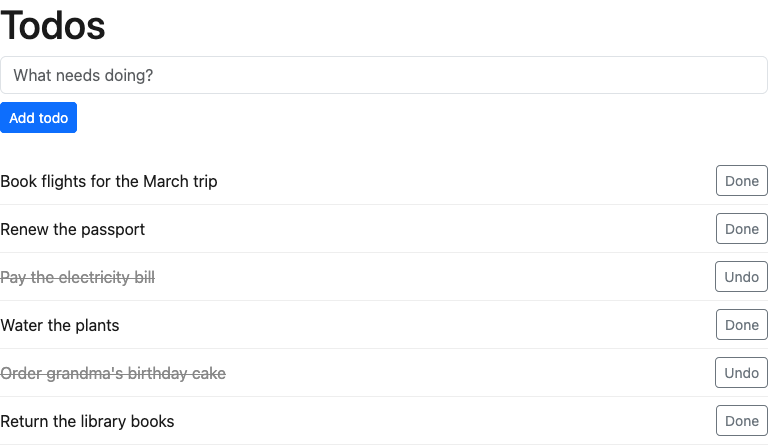
  <figcaption>the finished look it graduates to.</figcaption>
</figure>

In dev the server auto-reloads `main/` after a deploy, so the user sees the
change live. Commit in `main/` as a separate step when ready.

## User management

Users are managed under `/users/` (`djangoapp/views/users.py`). Every management
route requires a superuser; anyone else gets a 404. A user's identity in every
URL and response is `public_id` (a URL-safe UUID7); the integer `pk` is never
sent to clients. Trigram search (`/users/api/search?q=`, similarity across
first/last name + username) backs the list's jump-to-profile box;
`/users/edit/<public_id>` edits, and `/users/history/<public_id>` shows the
audit trail.

<figure>
  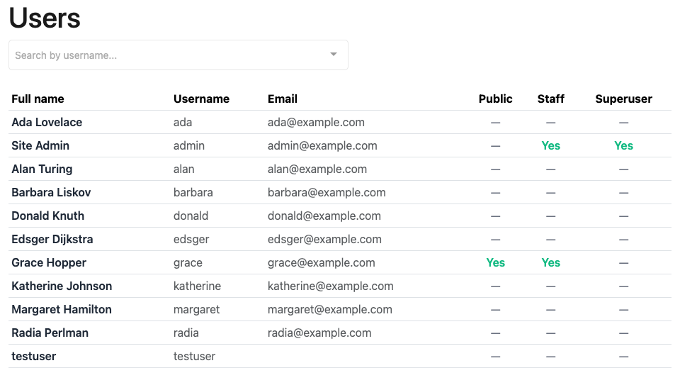
  <figcaption><code>/users/list</code> — paginated roster (25/page) with its jump-to-profile search.</figcaption>
</figure>

<figure>
  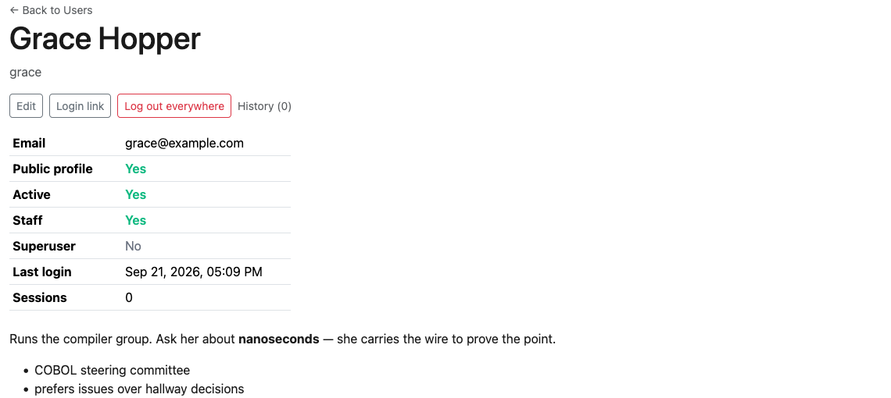
  <figcaption><code>/users/id/&lt;public_id&gt;</code> — profile; superusers get the admin panel (edit, login link, log out everywhere, history).</figcaption>
</figure>

A superuser can't clear their own `is_superuser`/`is_active`, so the active
superuser count can never fall to zero through the UI.

## Notifications

Every user's notifications live at `/notifications` (page + API), surfaced by
the navbar bell with an unread badge. Rows are stored, never TTL'd — they go
away only when the user deletes them; mark-read is presentation state. Any
view or Huey task records one with `Notification.record(...)`, which (on
commit) enqueues the Web Push fan-out as its own task — push-service HTTP
never runs inline in a request.

Browser (Web Push) delivery rides the user's live sessions: a subscription is
tied to its session's index row, so logout or session GC cascade-drops it —
dead devices never receive anything. Keys are VAPID: `./run djangomanage
generatevapid` writes the pair; with no key configured the page degrades to
in-app only.

<figure>
  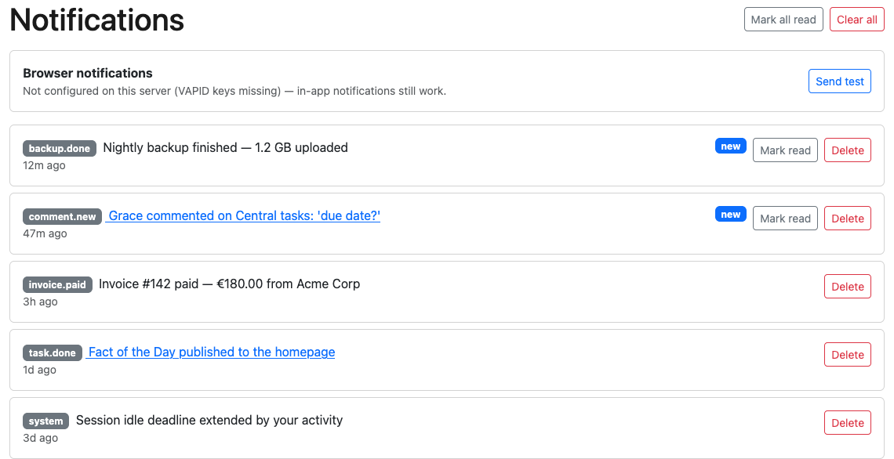
  <figcaption><code>/notifications</code> — the user's list: mark read, delete, clear, and the browser-push card.</figcaption>
</figure>

## Commands

App/dev via the `run` script: `init`, `runserver`, `dev`,
`pi`, `test`,
`typecheck`, `lintfix`, `playwrighttest`, `screenshots`, `checkframework1`,
`checkframework2`, `checkproject`, `createscratch`, `deployscratch`, `cleanscratch`,
`hueydev` (background consumer alone), `coverage`,
plus `djangomanage`/`python` passthroughs (e.g.
`./run djangomanage makemigrations`, `./run python manage.py …`).
User/management commands (via the passthrough):
`createuser <email> [--first-name …] [--last-name …] [--superuser]`,
`makeloginlink <email>` (one-time login URL),
`promotetosuperuser <email>`, `addoauth <provider> <client_id> <secret>`.

Test-VM lifecycle via the `testvm` script: `./testvm provision [--release …]`,
`./testvm delete`.


## Logging

The whole app — backend **and** frontend-reported errors — emits one
**JSON object per line** (NDJSON) so the stream is `jq`-filterable. Configure
it once in `djangoapp/logging.py`; `LoggingContextMiddleware` (in
`djangoapp/middleware.py`) binds per-request context.

### Backend

Every logger flows through one structlog `ProcessorFormatter`, so Django's own
loggers (`django.request`/`django.security`), third-party libs (allauth,
ninja, …) and our code all come out with the same shape. Import the logger from
`djangoapp.logging`, never `structlog` directly. Pass key/value fields (not an
f-string) so each line stays `jq`-filterable:

```python
from djangoapp.logging import get_logger

logger = get_logger(__name__)
logger.warning("files fetch failed", path=path, error=str(exc))   # recovered problem
try:
    risky()
except Exception:
    logger.exception("unhandled", method=request.method)         # structured traceback
```

`LoggingContextMiddleware` binds `method`, `path`, `user_public_id`, `username`
onto every line in a request (the integer `pk` is never logged). `exception` is a structured list of stack frames (local variables redacted), not a trailing string.

```bash
jq 'select(.level=="error")'
jq 'select(.logger=="client")'                              # frontend-reported errors
jq 'select(.event=="http request" and .user_public_id=="<id>")'
```

### Frontend errors

Uncaught browser errors are captured globally (`window error`,
`unhandledrejection`, Vue `errorHandler`) by `frontend/src/utils/clientError.ts`
and POSTed (async, `await`ed) to `/client-errors`, which logs them on the
**`client`** logger (`source=client`). Each report carries the browser source
location (`client_filename`/`client_lineno`/`client_colno`, resolvable against
the emitted sourcemap), `url`, `user_agent`, Vue's `info` hint, and the
reporter's `public_id`; the backend re-derives the authoritative identity from
`request.user` (never the body) and accepts anonymous reports (`user=null`). A
`navigator.sendBeacon` fallback fires on `pagehide` only while a POST is in
flight, so an error caught right before navigation isn't lost (and isn't re-sent
once delivered). Redis is a hard dependency for the per-identity rate limit:
`REDIS_URL` (required) + `CLIENT_ERROR_RATE_LIMIT` (optional, commented in
`.env.example`; default 30 per 60s) drive it, and if redis is unreachable
the endpoint **fails
closed** (500 — the redis error propagates to the global handler) rather than
accepting an unbounded stream.

```bash
jq 'select(.source=="client")'        # every frontend-reported error
jq 'select(.source=="client" and .user_public_id=="<id>")'
```

Sourcemaps are emitted in every build (`vite.config.js` `sourcemap: true`) for
offline/server-side row:col resolution; the serving layer must deny `*.map`
under `/static/djangoapp/` so they never reach clients.

### Searching captured errors

Backend errors, huey failures, and frontend-reported errors are all captured
as NDJSON in the journals (`app_granian`, `app_huey`) and can be queried with
[miller](https://miller.readthedocs.io) (`mlr`) straight off `journalctl` —
streaming, no intermediate files. Inside the VM:

```bash
# every error for one user — backend AND frontend, both units in one pass
journalctl -u app_granian.service -u app_huey.service -o cat --since=-1h \
  | grep '^{' \
  | mlr --jsonl filter '$level=="error" || $source=="client"' \
    then filter '$username=="<username>"' \
    then cut -o -f timestamp,source,level,event,client_message
```

Minified frontend stacks (`main-<hash>.js:line:col`) decode back to source
with `frontend/scripts/decode-stack.mjs` against the build's sourcemaps. The
full cookbook — per-origin queries, groupings, decoding, a real sample corpus
in `docs/errors/` — is in [docs/logging.md](docs/logging.md).

## Testing

Four tiers:

- **`deployscratch`** — the ONE command, run from `main/` once per edit batch: ruff +
  mypy (whole codebase), `ourapp`'s own tests only, and the frontend
  lint/type-check/build. Skips the framework suite and Playwright (those run in
  `main/`) — unless the edit touches framework files (outside `ourapp/` +
  `frontend/src/ours/`), which adds the tagged `scratch-test-subset` smoke tests.
- **`checkframework1`** — the full gate, run in `main/`. ruff + mypy + the whole backend
  suite + frontend lint/type-check + Playwright.
- **`checkframework2`** — the deployment gate (destructive: the previous VM is
  deleted). The host rebuilds the test VM from scratch (`./testvm`), then runs
  the in-VM gate (`deploy/vm.sh gate`, dispatched like the other guest-side
  helpers) over one multipass exec — the gate's exit code is the verdict. The
  gate:
  - deploys the Books test app over the VM's `ourapp/`
  - smokes the live stack over HTTPS on the VM's loopback (login link →
    session, superuser gates, agent-user readiness)
  - runs the agent's full scratch cycle as the agent user:
    `createscratch` (with both refusal guards) → marker edit →
    `deployscratch` provably live (marker served after the granian restart) →
    `cleanscratch`
- **`checkproject`** — overlay validation against a real app. Two `createscratch`
  cycles:
  1. Overlays the **test app** (`djangoapp/tests/testapp/`) → runs the full suite
     with `RUN_PROJECT_TESTS=1` (project tests un-skipped: real models/git/files).
  2. Overlays the **reference app** (`docs/reference/`) → runs its own tests.

The **test app** (`djangoapp/tests/testapp/`) is a fixture: a complete `ourapp/`
with models exercising every field kind + both FK types, plus an `ours/` page. The
**reference app** (`docs/reference/`) is the user-facing example, same format,
shipping its own tests. Both are excluded from ruff/mypy (they're only valid when
overlaid onto `ourapp/`).

The README's committed screenshots ([docs/screenshots/](docs/screenshots/)) come
from a fifth, `screenshots`-tagged Playwright pass that self-gates on the
`GENERATE_SCREENSHOTS` env var: `./run test` never collects it (it carries the
`playwright` tag), `./run playwrighttest` collects it as skips, and `./run
screenshots` (which sets the var) runs it. The models-management shots need the
testapp overlay — [docs/screenshots/README.md](docs/screenshots/) has the
recipe.

