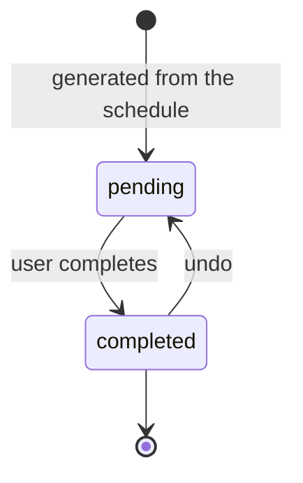

# Sample markdown

A markdown file rendered by the file viewer, with a linked image.

Links: [another file](other.md), an [external site](https://example.com), a
[hash link](#section-two), a [subdir link](sub/other.md), a
[root-anchored link](/djangoapp/tests/filefixtures/other.md), a
[dot-segment link](sub/../other.md), a
[workroot-climbing link](../../../other.md), and an
[escape link](../../../../../users/list).

## Section one

One paragraph under section one.

## Section two

The target of the in-page hash link above.

## Heading 03

## Heading 04

## Heading 05

## Heading 06

## Heading 07

## Heading 08

## Heading 09

## Heading 10

## Heading 11

## Heading 12

## Heading 13

## Heading 14

## Heading 15

## Heading 16

## Heading 17

## Heading 18

## Heading 19

## Heading 20

## Heading 21

## Heading 22

## Heading 23

## Heading 24

Long enough (24 headings) that the outline exceeds its 300px collapsed cap.

