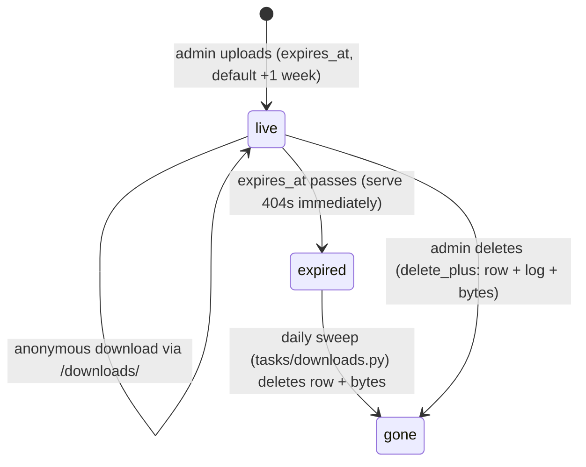
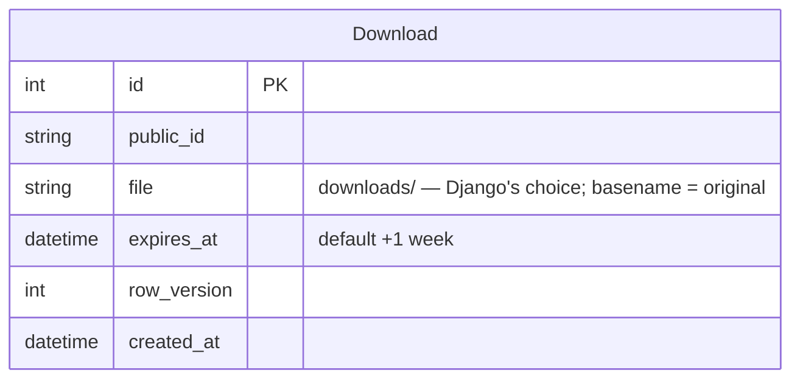

# Downloads

Admin-uploaded files, anonymously downloadable until an expiry date — the
reference illustration of the framework's three media primitives.

## What it shows

- **Files live in `media/downloads/`**: one fixed folder for the feature;
  Django's storage chooses the filename (the original name, deconflicted
  with a random suffix on collision — same-name uploads coexist). The serve
  route's `path` converter matches the `downloads/<name>` shape. URLs are
  therefore guessable from filenames; the expiry gate is the guard.
- **File cleanup rides the tracked pair**: reassign + `save_plus` deletes
  the OLD file after commit (a rollback keeps the edit and the old file);
  `delete_plus` removes the row, its audit log, and its files together
  (delete endpoint + the sweep). With a bare `.save()`/`.delete()` the old
  file stays on disk with nothing pointing at it — there is no separate
  cleanup call to forget.
- **`serve_file` serving**: Django `FileResponse` for direct requests; for
  requests that arrived through the reverse proxy (detected per-request via
  `X-Forwarded-For` — only Caddy can set it there), an empty
  `X-Accel-Redirect` response hands byte-streaming to the Caddyfile's
  `reverse_proxy` interception (disposition under the original name included
  is copied onto the served file; the header path is an internal carrier,
  never a route).

## Lifecycle

## Endpoints

| Route | Who | What |
| --- | --- | --- |
| `GET /downloads` | superuser | manager page (`ours/DownloadsPage`): list, upload, replace, delete |
| `POST /downloads/upload` | superuser | multipart create; optional `expires_at` (datetime-local; past picks 404) |
| `POST /downloads/{public_id}/replace` | superuser | multipart swap — reassign + `save_plus` |
| `POST /downloads/{public_id}/delete` | superuser | row + audit log + bytes; replies `{"deleted": public_id}` |
| `GET /downloads/{path:storage_name}` | **anonymous** | expiry gate → `serve_file` (original name preserved) |

The serve route is the expiry gate: expired or unknown names 404 alike.
Storage names are the original filenames (guessable), so the expiry date —
not URL secrecy — is what guards a download.
The sweep (3:00 daily, off midnight so `facts` keeps 00:00) removes row +
bytes, logging one `expired downloads swept` milestone; until it runs, the
gate already refuses.

Note for copyists widening upload access beyond superusers: there is no
upload size or content-type limit today — an accepted risk on an
admin-only surface, not a pattern to inherit blindly.

## The sweep

`tasks/downloads.py` wraps `Download.delete_expired()` (fat model, thin
wrapper — same shape as `choose_fact_of_the_day`). Each expired row goes
through `delete_plus(actor=None)`: row + audit log + bytes in one
transaction, so bytes die post-commit and a rolled-back sweep removes
nothing.
